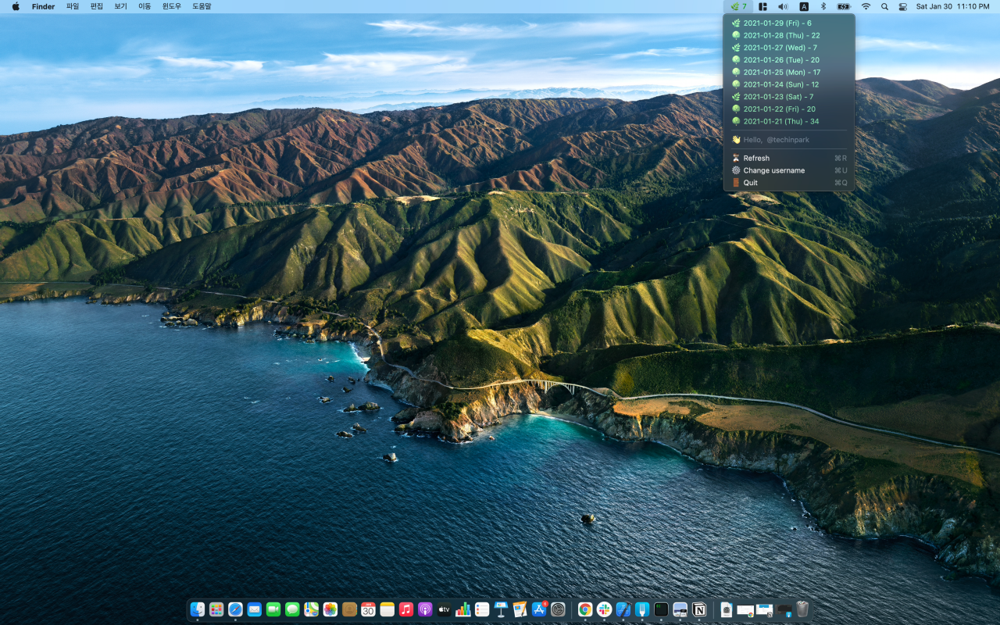

# Jandi 


[](https://github.com/techinpark/jandi/blob/main/LICENSE)
[](https://github.com/techinpark/jandi)
[](https://developer.apple.com/swift/)


## Introdution 🔍 

🌱 Check your GitHub contributions easily from the MacOS status bar. Written in Swift 5.0

## Preview 👀



## Requirements 

- `Jandi` is written in Swift 5.0
- Compatible with macOS 10.12 + 

## Install 

### Homebrew CLI 

```sh
$ brew update 
$ brew install --cask jandi-statusbar 
```

### AppStore

<a href="https://apps.apple.com/us/app/jandi-growth-your-code/id1551460285?mt=12&amp;itsct=apps_box&amp;itscg=30200" style="display: inline-block; overflow: hidden; border-radius: 13px; width: 250px; height: 83px;"></a>


## Find this repository useful ? ❤️

Support it by joining [stargazers](https://github.com/techinpark/Jandi/stargazers) for this repository. ⭐  
And [follow](https://github.com/techinpark) me for my next creations! 🤩

<a href="https://www.producthunt.com/posts/jandi-github-contribution-on-statusbar?utm_source=badge-featured&utm_medium=badge&utm_souce=badge-jandi-github-contribution-on-statusbar" target="_blank"></a> 

## Author 
- [techinpark](https://twitter.com/techinpark)

## Contributions 
Pull requests and issues are always welcome.  
Please open any issues and PRs for bugs, features, or documentation.


## License 
`Jandi` is available under the MIT license. See the LICENSE file for more info.

